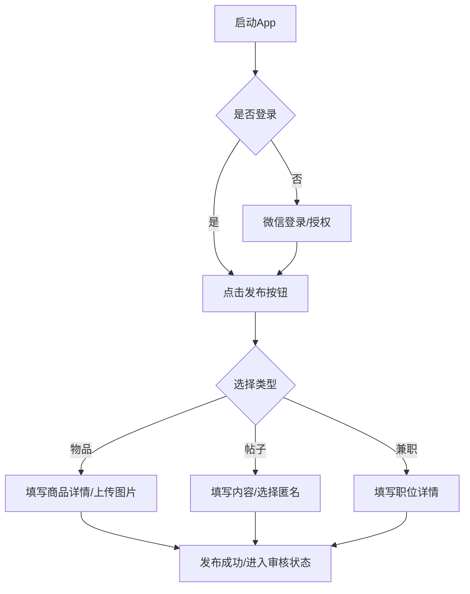
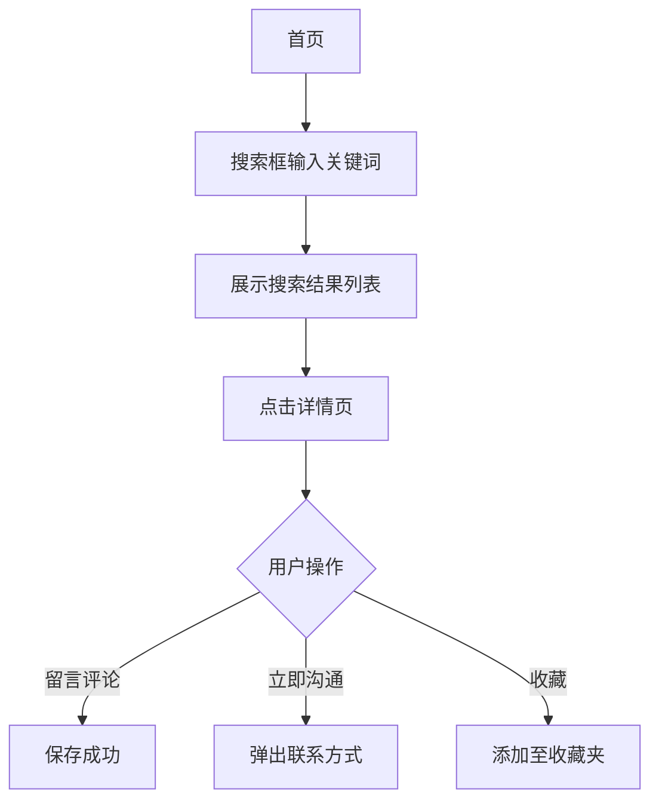

# 青里 (Qingli) 产品需求文档 (PRD)

## 1. 项目概览

### 1.1 背景与痛点
在大学校园环境下，学生之间存在大量的闲置物品交易、信息分享、兼职寻觅以及失物招领需求。目前这些需求分散在微信群、贴吧或通用闲置平台，存在以下痛点：
- **信息碎片化**：交易信息容易被群聊淹没，难以检索。
- **信任成本高**：通用平台鱼龙混杂，校内交易缺乏身份背书。
- **效率低下**：失物招领信息传播慢，找回概率低。
- **缺乏社区感**：单纯的交易工具缺乏校园生活的互动性。

### 1.2 核心目标
打造一个**专属于校内师生**的一站式生活服务社区平台。
- **高效交易**：提供便捷的闲置物品发布与搜索功能。
- **真实社区**：通过校内社交广场，增强校友间的互动与信任。
- **精准服务**：集成兼职信息、失物招领等校园高频工具。

---

## 2. 用户分析

### 2.1 目标用户
- **在校学生**：核心用户群，需求包括买卖闲置、找兼职、失物归还、校园社交。
- **教职员工**：潜在用户，主要进行高质量闲置处分或信息发布。
- **校内/周边商家**：发布合规的兼职信息。

### 2.2 使用场景
- **开学/毕业季**：学生处理学长学姐留下的书籍、生活用品。
- **空闲时段**：刷广场动态，参与校园话题讨论，寻找感兴趣的兼职。
- **突发情况**：丢失物品或捡到东西时，第一时间到平台发布。

---

## 3. 核心功能清单

### 3.1 闲置交易板块 (Goods)
- **发布商品**：支持上传多张图片、设置名称、描述、价格和校内交易地点。
- **商品展示**：首页采用瀑布流布局，支持按“推荐”和“最新”排序。
- **状态管理**：商品支持“上架”、“交易中”、“已售出”和“下架”状态切换。
- **搜索系统**：支持关键字模糊搜索校内物品。

### 3.2 校园广场 (Post)
- **动态发布**：支持图文内容，可选择分类（如：失物招领、校园生活）。
- **匿名功能**：保护用户隐私，支持开启匿名发布模式。
- **互动评论**：用户可对动态进行评论、回复及点赞（收藏）。
- **可见范围**：支持设置全校可见、本院可见或仅好友可见。

### 3.3 兼职信息 (Part-Time Job)
- **信息展示**：展示工作时间、地点、薪资、结算方式及招聘要求。
- **联系方式**：直接展示或跳转联系发布者，提高沟通效率。

### 3.4 失物招领 (Lost & Found)
- **分类搜索**：区分“失物”与“招领”两大类。
- **关键特征记录**：记录拾取/丢失的时间、地点及物品特征。

### 3.5 用户中心 (User)
- **微信一键登录**：降低注册门槛，同步微信昵称与头像。
- **个人动态管理**：查看我发布的商品、帖子及收藏的内容。

---

## 4. 业务流程

### 4.1 核心发布流程

### 4.2 搜索与交互流程

---

## 5. 原型设计与交互逻辑

### 5.1 界面布局
- **首页 (Index)**：顶部搜索栏固定 + 宫格金刚区（广场、兼职等入口）+ 底部双列瀑布流卡片。
- **广场 (Square)**：顶部标签页分类（关注、推荐、最新）+ 单列社交长卡片设计。
- **发布页 (Publish)**：采用底部弹窗弹出选择矩阵（闲置、帖子、寻务），进入具体表单填写页。
- **详情页 (Detail)**：沉浸式大图展示 + 吸底交互栏（收藏、评论、联系他）。

### 5.2 交互规范
- **手势操作**：支持下拉刷新、上拉加载更多（分页加载）。
- **反馈设计**：操作成功弹出 Toast 提示，加载过程使用骨架屏或 Loading 动画。

---

## 6. 质量要求

### 6.1 性能要求
- **首屏加载**：资源压缩，首页接口响应控制在 500ms 以内。
- **图片处理**：图片根据展示区域自动缩略，降低带宽消耗。

### 6.2 安全性
- **身份认证**：基于 JWT 的持久化登录机制，保护接口访问。
- **敏感词过滤**：帖子与评论内容接入敏感词库过滤，防止违规内容发布。
- **逻辑删除**：业务数据采用逻辑删除，确保数据可恢复性及审计性。

### 6.3 兼容性
- **移动端**：适配微信小程序主流机型、iOS 与 Android 系统的全面屏适配。

---

## 7. 技术选型

### 7.1 前端 (Frontend)
- **框架**：uni-app (Vue 3 + Vite)
- **语言**：JavaScript / JavaScript
- **样式**：SCSS + CSS 变量（定义主题色如：#F6D365）
- **UI 组件**：uni-ui + 自定义高级 UI 组件（如：xq-tab-bar）

### 7.2 后端 (Backend)
- **主框架**：Spring Boot 3.4.1 (Java 17)
- **持久层**：MyBatis-Plus 3.5.7
- **数据库**：MySQL 8.0
- **工具类**：Lombok, FastJSON2, Hutool, Apache Commons Lang3

### 7.3 第三方服务/API
- **身份验证**：微信小程序登录 API (uni.login)
- **接口文档**：Knife4j (Swagger 3 / OpenAPI 3)
- **存储**：本地文件存储 (后期可扩展为 OSS)
